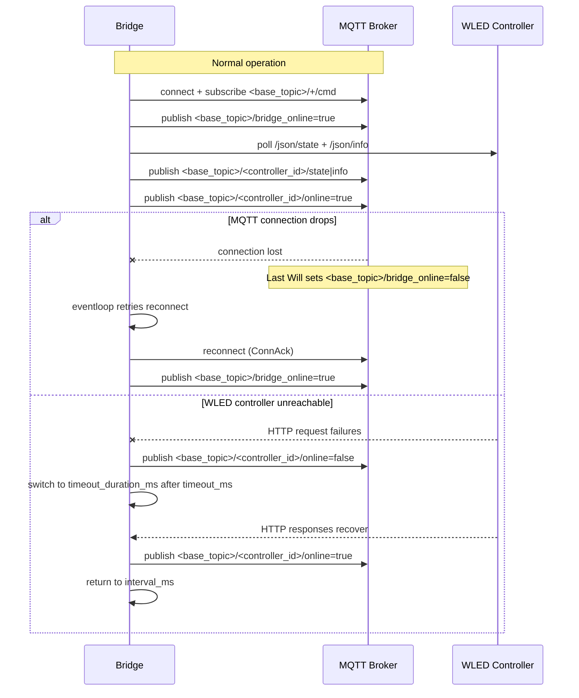

# Operations

## Day-to-day commands

Start:

```bash
docker compose up -d
```

Status:

```bash
docker compose ps
```

Logs:

```bash
docker compose logs -f wled-mqtt-bridge
```

Update image:

```bash
docker compose pull
docker compose up -d
```

## Healthcheck

The container runs an internal healthcheck using:

```text
wled-mqtt-bridge --config /app/config/config.yml --healthcheck
```

## Failure And Recovery Flow


